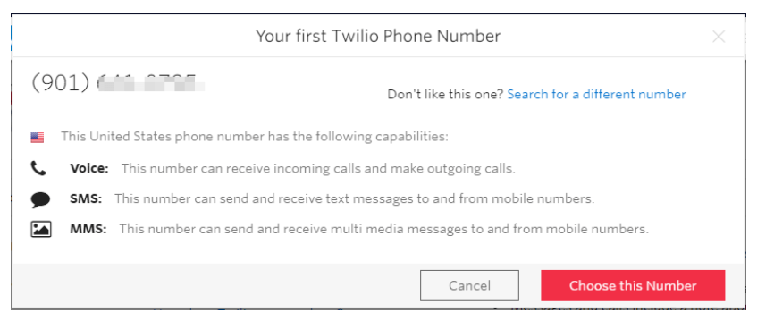

# sms_project
send sms using python and twilio cloud services .

# Follow this intructions

## Project setup
 1. create a virtualenvironment.  
  python -m venv venv  
 2. activate venv.  
  .\venv\Scripts\activate  
 3. Install Twilio  
  pip install twilio  
  
  
## Configure twilio 
 1.create twilio account from here https://www.twilio.com/  
 2.To use Twilio, we need a trial number, account sid, and auth token.  
 We can find our account-specific configuration credentials on the Dashboard page of the account console as shown below:
 
 
 
 3. Click on the “Get a trial number” button to get a trial number.  
 
 
 
 I have created a free twilio account it's not a free service. 
 We can only sen sms twilio varified number. 
 Twilio Varified number means those numbers that are being used to create twilio account. 
 In this case you use your number that have used to create twilio account. 
 Twilio will provide a trail number sms will send from this number. 
 If We choose any plan we can send sms at any number.
