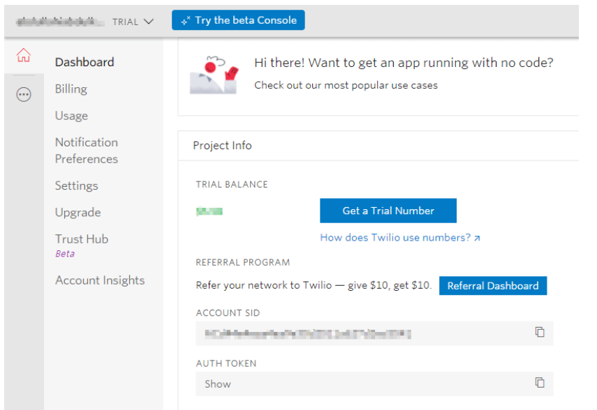

# sms_project
send sms using python and twilio cloud services .

# Follow this intructions

## create a virtualenvironment or you can use project venv
 python -m venv venv
## activate venv
  .\venv\Scripts\activate  
  
## Install twilio 
  pip install twilio
  
## Configure twilio 
 1.create twilio account from here https://www.twilio.com/
 2.To use Twilio, we need a trial number, account sid, and auth token. 
 We can find our account-specific configuration credentials on the Dashboard page of the account console as shown below:
 
 
